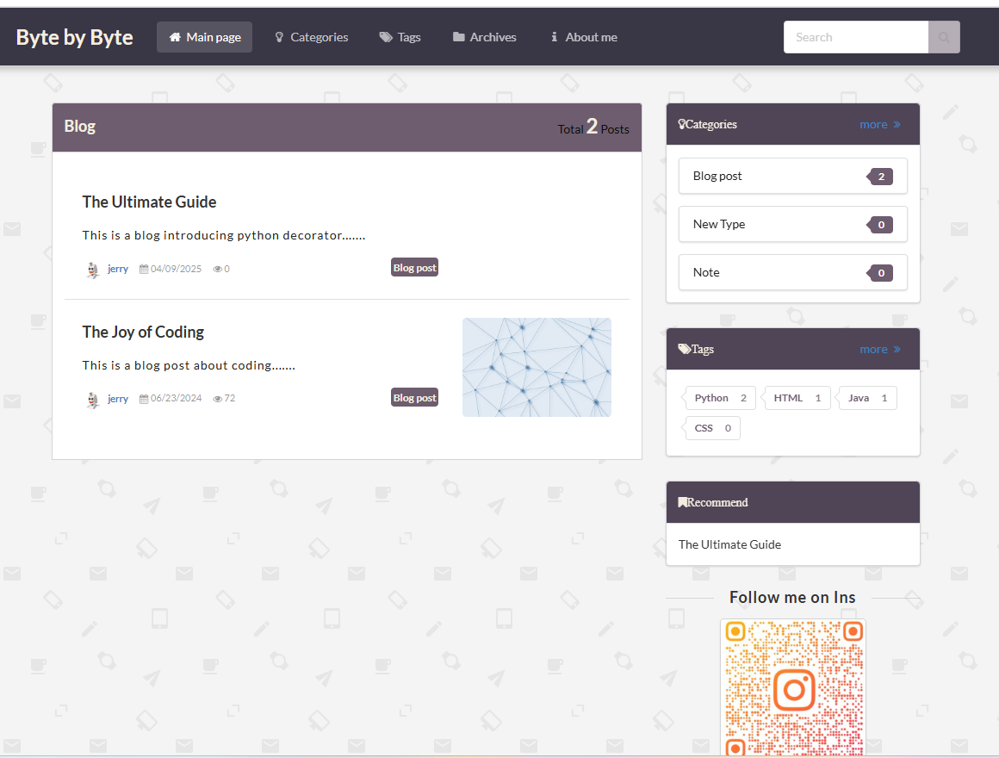
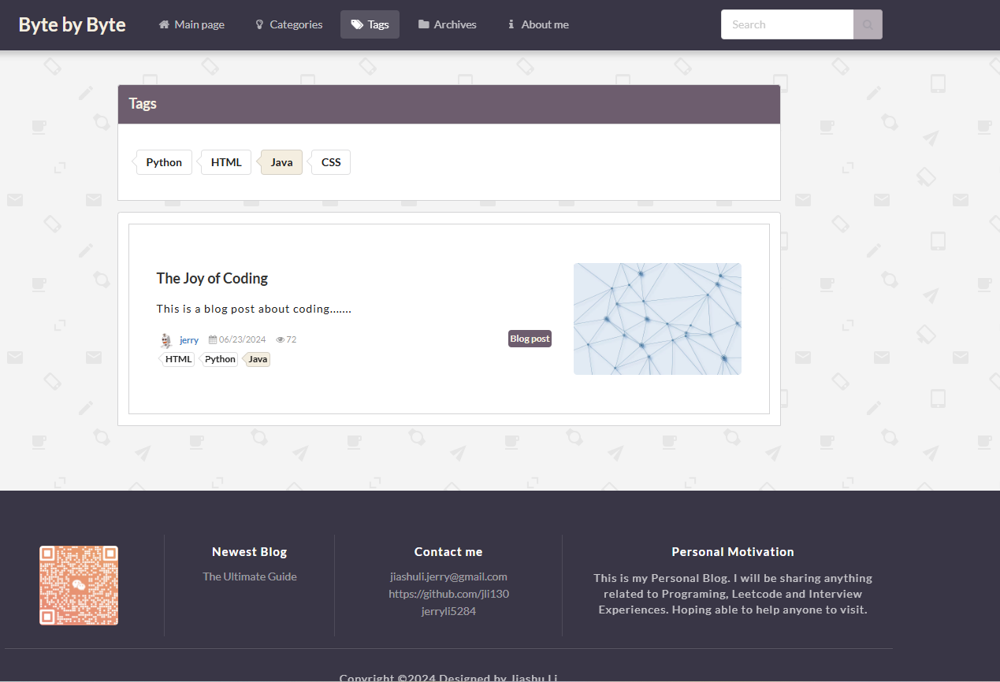
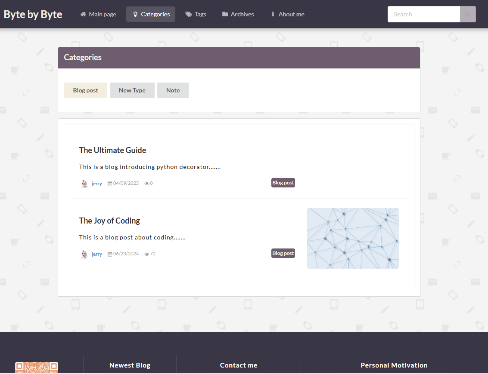
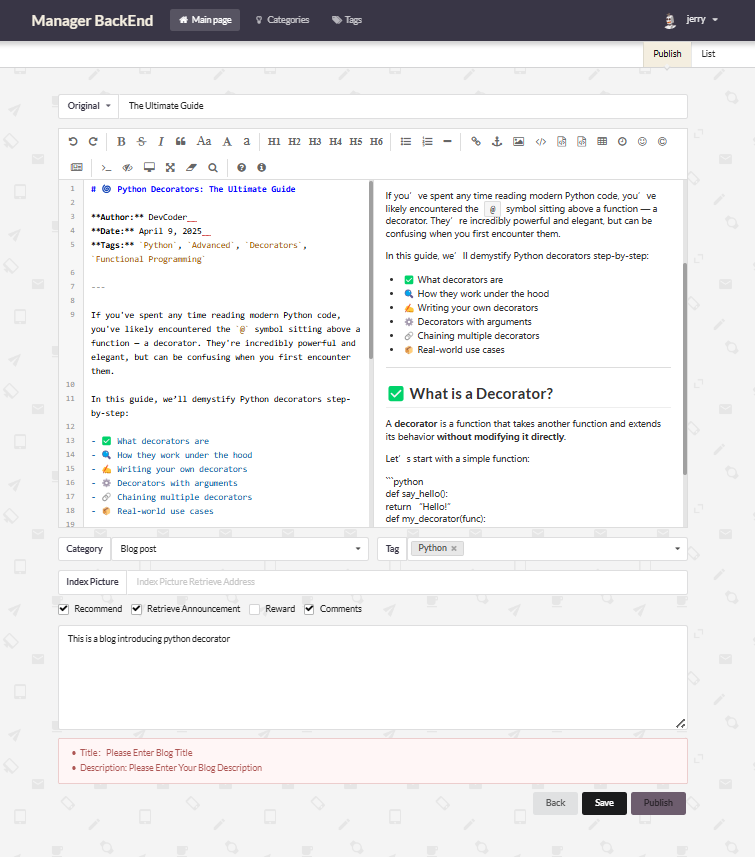
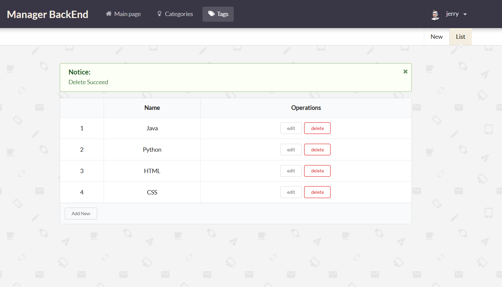
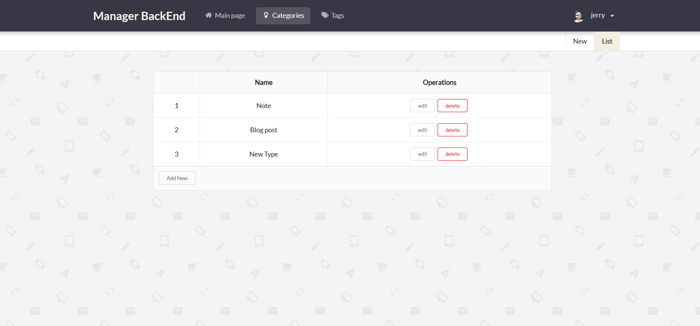
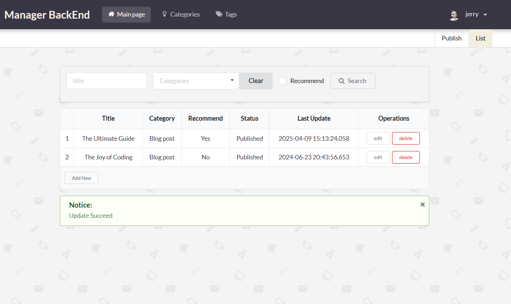
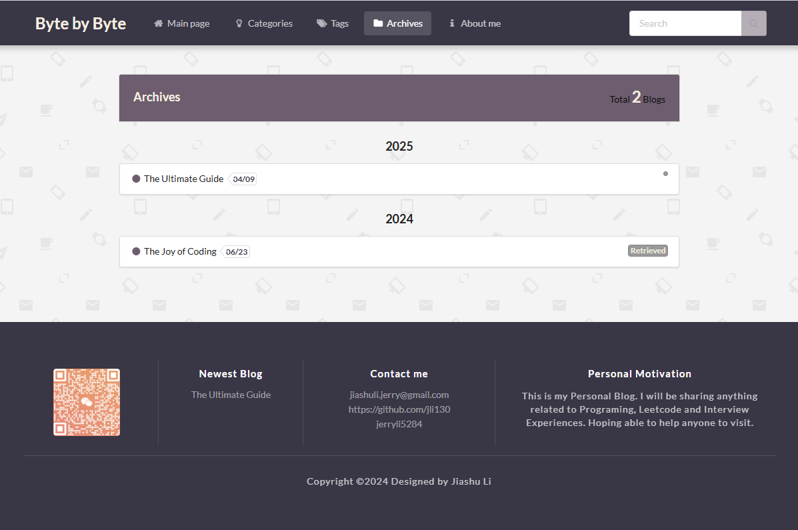
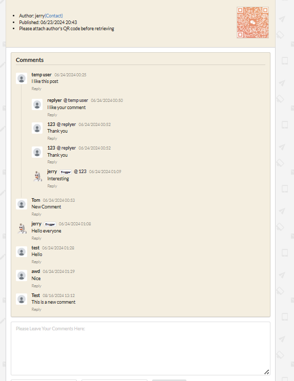

# 🧠 Byte by Byte – Personal Blog Platform

**Byte by Byte** is a full-stack personal blog platform built using **Spring Boot (Java)** and **Semantic UI**. It allows blog owners to manage content, control visibility, interact with users, and showcase curated posts — all stored and managed through a relational SQL database.

---

## 🌟 Features

### ✍️ For the Blog Owner / Admin:
- Create, edit, and delete blogs
- Organize posts by **tags** and **types**
- Enable/disable **comments** and **rewards**
- Manage personal **avatar**
- Set **recommended blogs** to display on the homepage
- View blog archives organized by **year**

### 💬 For Visitors:
- Browse blogs by **tags**, **types**, or **archives**
- Leave comments on blogs with commenting enabled
- **Reply to existing comments** for discussions
- View featured/recommended blogs on the home page

---

## 🛠️ Tech Stack

- **Frontend**: HTML, CSS, JavaScript, [Semantic UI](https://semantic-ui.com/)
- **Backend**: Spring Boot, Java, Spring MVC
- **Database**: SQL (MySQL / PostgreSQL / etc.)
- **Architecture**: MVC (Model-View-Controller)

---

## 🖼️ Screenshots

### 🏠 Home Page




### 📝 Blog Editor and manager (Admin View)





### 📚 Archives Page


### 💬 Comments Section



---

## 🚀 How to Run

1. **Clone the repository**

```bash
git clone https://github.com/yourusername/byte-by-byte.git
cd byte-by-byte

2. **Set up the database**

Configure your SQL database (e.g., MySQL)

Update application.properties or application.yml with your DB credentials

3. Run the Spring Boot application

bas1h
Copy
Edit
./mvnw spring-boot:run
4. Access the app

Open your browser and go to: http://localhost:8080

📂 Project Structure
csharp
Copy
Edit
byte-by-byte/
│
├── src/
│   ├── main/
│   │   ├── java/com/example/blog/
│   │   ├── resources/templates/     # Thymeleaf templates
│   │   ├── resources/static/        # CSS, JS, images
│   │   └── application.properties
│
├── pom.xml
└── README.md

🤝 Contributing
Contributions, issues, and suggestions are welcome! Feel free to fork the repo and submit a pull request.

